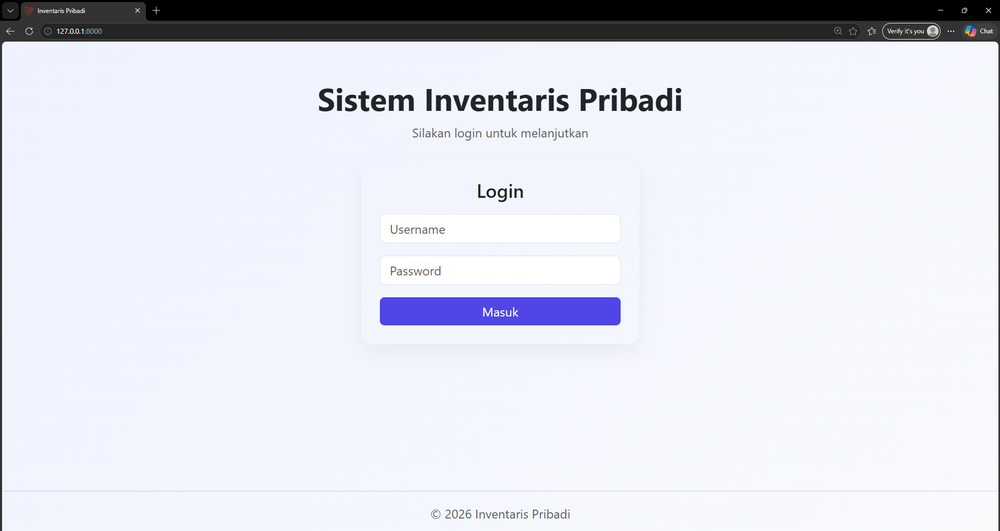
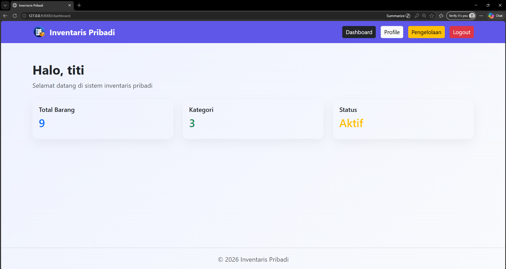
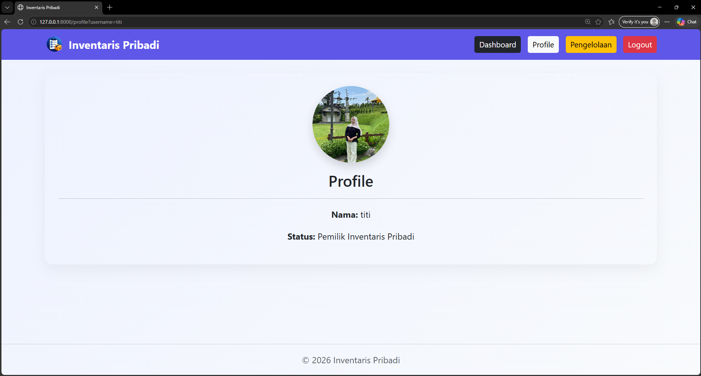
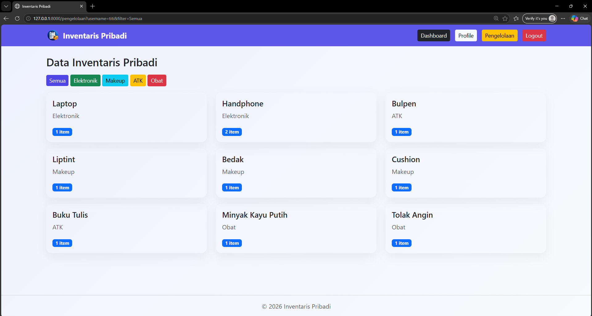

# UTS PWEB - Sistem Inventaris Pribadi

## Deskripsi Project
Website ini merupakan aplikasi Sistem Inventaris Pribadi berbasis Laravel yang digunakan untuk mengelola barang-barang pribadi berdasarkan kategori.

Website ini dibuat menggunakan konsep MVC (Model View Controller) tanpa menggunakan database, dimana data disimpan dalam bentuk array di controller.

## Tampilan Website

### Halaman Login

### Halaman Dashboard

### Halaman Profile

### Halaman Pengelolaan

